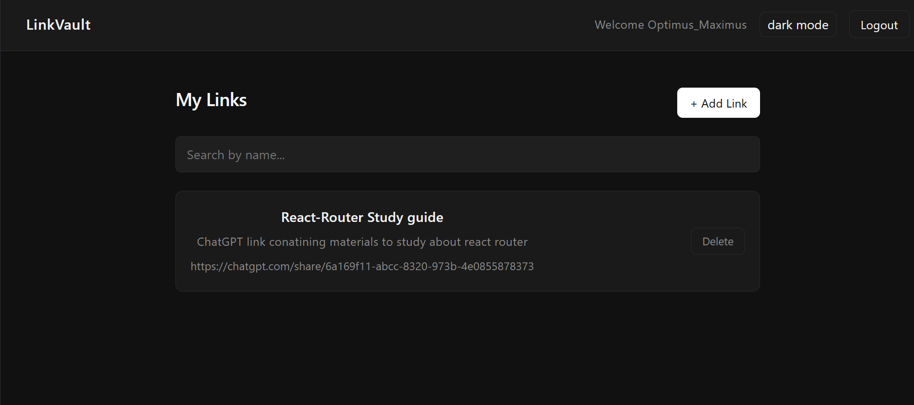

# LinkVault

A full-stack web app to save and organize your important links — built with the MERN stack.

# Live Demo

Frontend: https://link-vault-beta-one.vercel.app

Backend API: https://link-vault-backend-w18w.onrender.com

 

## Features

- JWT authentication (register, login, logout)
- Save links with a name, description and URL
- Delete links
- Search links by name instantly
- Dark / light mode toggle
- Protected routes on both frontend and backend
- Forgot password with OTP email verification

## Tech Stack

**Frontend**
- React (Vite)
- React Router DOM
- Axios
- CSS Variables (no UI library)

**Backend**
- Node.js
- Express.js
- MongoDB + Mongoose
- JWT (jsonwebtoken)
- bcryptjs

## Project Structure

```
link-vault/
├── backend/
│   ├── middleware/     # JWT auth guard
│   ├── models/         # User and Link schemas
│   ├── routes/         # Auth and Links API
│   └── server.js       # Entry point
└── frontend/
    └── src/
        ├── api/        # Axios API functions
        ├── components/ # Navbar, LinkCard, AddLinkModal
        ├── context/    # Auth context (global state)
        └── pages/      # Login, Register, Dashboard
```

## Getting Started Locally

**1. Clone the repo**
```bash
git clone https://github.com/yourusername/link-vault.git
cd link-vault
```

**2. Setup backend**
```bash
cd backend
npm install
```

Create a `.env` file inside `backend/`:
```
PORT=5000
MONGO_URI=your_mongodb_atlas_uri
JWT_SECRET=your_secret_key
```

```bash
npm run dev
```

**3. Setup frontend**
```bash
cd frontend
npm install
npm run dev
```

App runs at `http://localhost:5173`

## API Endpoints

| Method | Endpoint | Description | Auth |
|--------|----------|-------------|------|
| POST | /api/auth/register | Register a new user | No |
| POST | /api/auth/login | Login and get token | No |
| GET | /api/links | Get all links | Yes |
| POST | /api/links | Add a new link | Yes |
| DELETE | /api/links/:id | Delete a link | Yes |

## Author

Nithin
[GitHub](https://github.com/NITHIN777-DOTCOM)
[LinkedIn](https://www.linkedin.com/in/nithin-r-876b5b373/)
